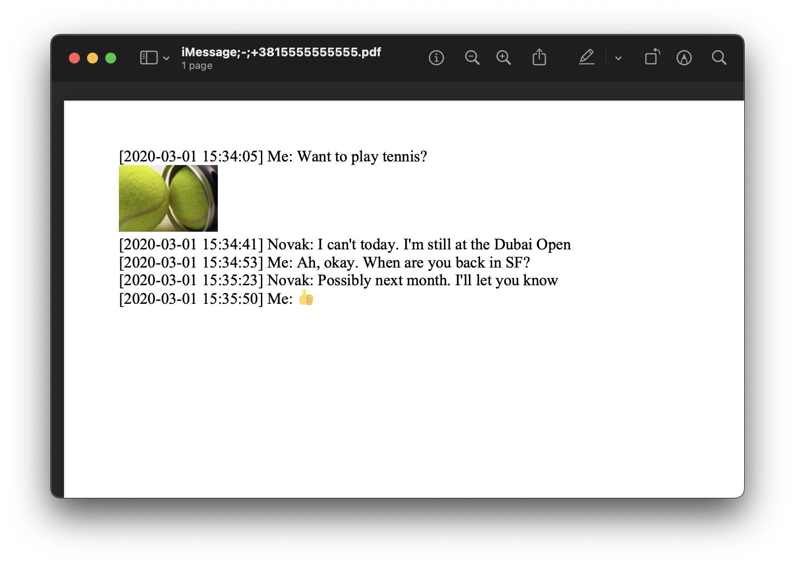

# bagoup [![Build Status][ci-img]][ci] [![Coverage Status][cov-img]][cov] [![Go Report Card][card-img]][card] [![Release][release-img]][release]

bagoup *(pronounced BAAGoop)* is an export utility for Mac OS Messages,
implemented in Go, inspired by
[Baskup](http://peterkaminski09.github.io/baskup/). It exports all of the
conversations saved in Messages to readable, searchable text or PDF files.

## Example Exports
### Plaintext (default)
```
$ cat "messages-export/Novak Djokovic/iMessage;-;+3815555555555.txt"
[2020-03-01 15:34:05] Me: Want to play tennis?
<attached: tennisballs.jpeg>
[2020-03-01 15:34:41] Novak: I can't today. I'm still at the Dubai Open
[2020-03-01 15:34:53] Me: Ah, okay. When are you back in SF?
[2020-03-01 15:35:23] Novak: Possibly next month. I'll let you know
[2020-03-01 15:35:50] Me: 👍
```
### PDF (--pdf flag)

## Dependencies
- [python-typedstream](https://github.com/dgelessus/python-typedstream) (for compatibility with Messages on Mac OS 13 and newer)
```
git clone git@github.com:dgelessus/python-typedstream.git
cd python-typedstream
python3 -m pip install .
```
- [wkhtmltopdf](https://wkhtmltopdf.org/) (for exporting to PDF; not needed for exports to plaintext)
```
brew install wkhtmltopdf
```

## Installation
```
brew tap tagatac/bagoup
brew install bagoup
```

## Protected File Access
The Messages database is a protected file in Mac OS. See
[this article](https://appletoolbox.com/seeing-error-operation-not-permitted-in-macos-mojave/)
for more details. Additionally, attachments can be located in various protected
places on your filesystem.

To to backup your messages, you have two options. If you wish to export to PDFs
with images (`--pdf` flag), or to copy attachments (`--copy-attachments` flag), you must use
the first option.
### Option 1 (required for attachments): Give your terminal emulator full disk access
From [osxdaily.com](https://osxdaily.com/2018/10/09/fix-operation-not-permitted-terminal-error-macos/):
1. Pull down the Apple menu and choose "System Preferences"
1. Choose "Security & Privacy" control panel
1. Now select the "Privacy" tab, then from the left-side menu select "Full Disk Access"
1. Click the lock icon in the lower left corner of the preference panel and authenticate with an admin level login
1. Now click the [+] plus button to add an application with full disk access
1. Navigate to the /Applications/Utilities/ folder and choose "Terminal" (or your terminal emulator of choice) to grant your terminal with Full Disk Access privileges
1. Relaunch your terminal emulator, and the “Operation not permitted” error messages will be gone

If you choose this option, bagoup will be able to open **chat.db** in its
default location, and the `--db-path` flag is not needed.
### Option 2 (more secure if attachments are not desired): Copy chat.db
Copy the Messages database to an unprotected folder in Finder, and provide the
path to the copy via the `--db-path` flag.

1. Open Finder.
1. Navigate to **~/Library/Messages**.
1. Right-click on **chat.db**, and click **Copy "chat.db"** in the context menu.
1. Navigate to your home folder or another unprotected folder.
1. Right-click in the unprotected folder, and click **Paste Item** in the
context menu.

## Contact Information (optional)
If you provide your contacts via the `--contacts-path` flag, bagoup will attempt
to match the handles from the Messages database with full names from your
contacts list, labeling the folders with full names and each message with first
names. Otherwise, phone numbers and email addresses will be used.

The contacts file must be in vCard format and can be obtained,
e.g., from the Contacts app or Google Contacts.

## Usage
```
Usage:
  bagoup [OPTIONS]

Application Options:
  -i, --db-path=          Path to the Messages chat database file (default: ~/Library/Messages/chat.db)
  -o, --export-path=      Path to which the Messages will be exported (default: messages-export)
  -m, --mac-os-version=   Version of Mac OS, e.g. '10.15', from which the Messages chat database file was copied (not needed if bagoup is running on the same Mac)
  -c, --contacts-path=    Path to the contacts vCard file
  -s, --self-handle=      Prefix to use for for messages sent by you (default: Me)
      --separate-chats    Do not merge chats with the same contact (e.g. iMessage and SMS) into a single file
  -p, --pdf               Export text and images to PDF files (requires full disk access)
      --include-ppa       Include plugin payload attachments (e.g. link previews) in generated PDFs
  -a, --copy-attachments  Copy attachments to the same folder as the chat which included them (requires full disk access)
  -r, --preserve-paths    When copying attachments, preserve the full path instead of co-locating them with the chats which included them
  -t, --attachments-path= Root path to the attachments (useful for re-running bagoup on an export created with the --copy-attachments and --preserve-paths flags) (default: /)
  -v, --version           Show the version of bagoup

Help Options:
  -h, --help              Show this help message
```
All conversations will be exported as text (default) or PDF files (`--pdf` flag) to the specified export
path. See [example-exports](example-exports) for
an example export directory structure for each option.

## Performance
### Plaintext
Export to plaintext is fast. For example, on an M1 Pro MacBook Pro, exporting
**13,445 messages** from 93 chats to 88 files, as well as copying
**848 attachments**, took **21s**.
```
BAGOUP RESULTS:
bagoup version: 2.3-9-g5273031 Darwin/arm64
Export folder: "messages-export"
Export files written: 88
Chats exported: 93
Valid messages exported: 13445
Invalid messages exported (see warnings above): 10
Attachments copied: 848
	image/heic-sequence: 1
	image/heic: 207
	video/quicktime: 20
	image/gif: 20
	image/png: 55
	application/pdf: 3
	text/vcard: 3
	audio/x-m4a: 1
	text/x-vlocation: 1
	application/octet-stream: 423
	image/jpeg: 111
	image/tiff: 3
Attachments referenced or embedded: 855
	video/quicktime: 20
	image/gif: 20
	application/pdf: 3
	text/vcard: 3
	application/octet-stream: 429
	image/heic: 208
	image/tiff: 3
	image/png: 55
	image/heic-sequence: 1
	audio/x-m4a: 1
	image/jpeg: 111
	text/x-vlocation: 1
Attachments embedded: 0
Attachments missing (see warnings above): 7
HEIC conversions completed: 0
HEIC conversions failed (see warnings above): 0
Time elapsed: 20.973077459s
```
### PDF
Export to PDF is significantly slower, bottlenecked by PDF creation with
`wkhtmltopdf`. Exporting the same data from above on the same MacBook took
**6m58s**, nearly 20x slower than the export to plaintext.
```
BAGOUP RESULTS:
bagoup version: 2.3-9-g5273031 Darwin/arm64
Export folder: "messages-export"
Export files written: 88
Chats exported: 93
Valid messages exported: 13445
Invalid messages exported (see warnings above): 10
Attachments copied: 0
Attachments referenced or embedded: 855
	text/vcard: 3
	image/jpeg: 318
	image/tiff: 3
	video/quicktime: 20
	image/gif: 20
	image/heic-sequence: 1
	audio/x-m4a: 1
	text/x-vlocation: 1
	application/octet-stream: 429
	image/png: 55
	image/heic: 1
	application/pdf: 3
Attachments embedded: 396
	image/png: 55
	image/gif: 20
	image/jpeg: 318
	image/tiff: 3
Attachments missing (see warnings above): 7
HEIC conversions completed: 207
HEIC conversions failed (see warnings above): 0
Time elapsed: 6m58.053383125s
```

## Author
Copyright (C) 2020-2023  [David Tagatac](mailto:david@tagatac.net)  
See main.go for usage terms.

[ci-img]: https://github.com/tagatac/bagoup/actions/workflows/makefile.yaml/badge.svg?branch=main
[ci]: https://github.com/tagatac/bagoup/actions?query=branch%3Amain
[cov-img]: https://codecov.io/gh/tagatac/bagoup/branch/main/graph/badge.svg
[cov]: https://codecov.io/gh/tagatac/bagoup
[card-img]: https://goreportcard.com/badge/github.com/tagatac/bagoup
[card]: https://goreportcard.com/report/github.com/tagatac/bagoup
[release-img]: https://img.shields.io/github/release/tagatac/bagoup.svg
[release]: https://github.com/tagatac/bagoup/releases/latest
